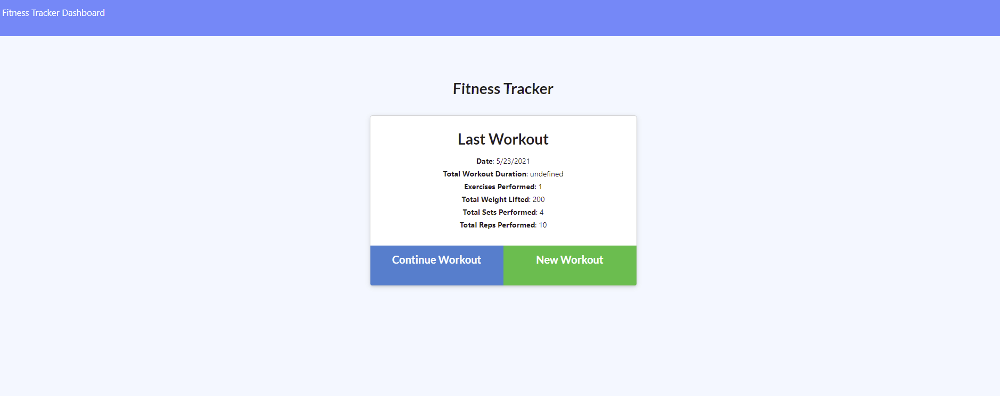

# Workout Tracker

  [](https://opensource.org/licenses/ISC)

  ## Description

  This is an application for tracking workouts.

  ## Table of Contents

  * [Installation](##-installation)
  * [Usage](##-usage)
  * [License](##-license)
  * [Questions](##-questions)
  * [Deployed Link](##-deployed-link)
  * [Site Screenshot](##-site-screenshot)

  ## Installation

  To install the necessary dependencies, run the following command:
  ```
  npm i
  ```

  ## Usage

  One might use this to track their workouts.

  ## License

  This projects is licensed under the ISC license.

  ## Questions

  If you have any questions about the repo, open an issue or contact me directly at [aisthorpe@gmail.com](mailto:aisthorpe@gmail.com). You can find more of my work at [naisthorpe](https://www.github.com/naisthorpe).

  ## Deployed Link
  https://track-that-workout-bb.herokuapp.com/

  ## Site Screenshot


